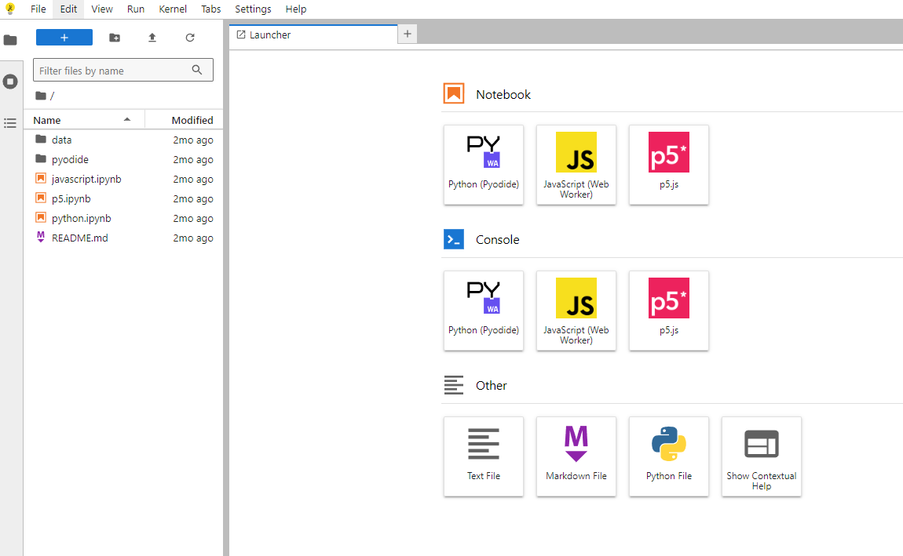
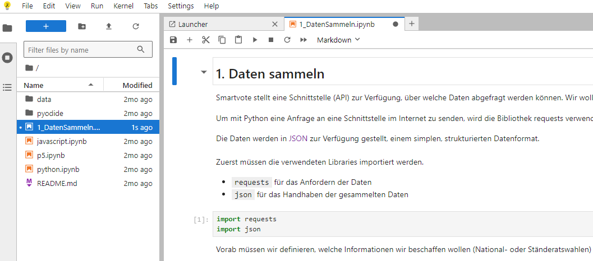
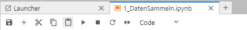

# Parldigi Masterclass

Diese Parldigi Masterclass dient der Einführung in das Thema von Algorithmen, Daten, und Software in der Politik.
Zu Beispielszwecken werden wir mithilfe von Daten Arbeiten die von [Smartvote](https://www.smartvote.ch) bezogen werden können.

# Vorbereitung
Alle Codes sind in der Programmiersprache [Python](https://www.python.org/) geschrieben.
Um die Codes auszführen verwenden wir eine webbrowserbasierte Umgebung welche Python Codes ausführen kann.
Diese Umgebung nennt sich [JupyterLite](https://jupyter.org/try-jupyter/lab/).

## JupyterLite aufsetzen
Für das Ausführen der Code setzen wir auf [JupyterLite](https://github.com/jupyterlite) eine Open Source Applikation die die Ausführung von Python Code direkt im eigenen Webbrowser erlaubt,

### Vorgehen

#### Öffnen von JupyterLite
Gehen Sie auf https://jupyterlite.github.io/demo/lab/index.html 
Dadurch öffnet sich folgende Ansicht:

#### Importieren der Codes
Die Codes können Importiert werden mit `File` -> `Open from URL`.

Die URLs für die drei Dateien sind:
- https://raw.githubusercontent.com/digital-sustainability/parldigi-masterclass/refs/heads/main/1_DatenSammeln.ipynb
- https://raw.githubusercontent.com/digital-sustainability/parldigi-masterclass/refs/heads/main/2_DatenAnalysieren.ipynb
- https://raw.githubusercontent.com/digital-sustainability/parldigi-masterclass/refs/heads/main/3_Experimentieren.ipynb

#### Öffnen der ersten Datei
Auf der linken Seite sollte nun eine Date `1_DatenSammeln.ipynb` erscheinen. Diese kann durch einen Doppelclick geöffnet werden:

#### Ausführen von Codes
Innerhalb von JupyterLite sind die Codes in sogenannten Zellen organisiert. Zellen können entweder Text oder Code enthalten und die Codezellen können entsprechend ausgeführt werden.

Für das Ausführen von Code steht folgende Aktionsbar zur Verfügung:

Wenn eine Codezelle selektiert ist (erkennbar durch den dicken blauen Balken auf der linken Seite) kann diese ausgeführt werden.

Dafür verwendet man den "Play" Button.

---

## 0. Einführung

In diesem Projekt geht es darum, Daten von Smartvote einzusammeln und basierend darauf spannende Erkentnisse zu sammeln. Dazu sind vier Schritte notwendig

### 1. Daten sammeln
In einem ersten Schritt werden die Daten von Smartvote mithilfe der angebotenen Schnittstelle angefragt und gespeichert.

### 2. Die gesammelten Daten und erste Analysen machen

Im nächsten Schritt schauen wir uns die Daten etwas genauer an und erfassen einige ihrer Eigenschaften.

### 3. Mit den Daten experimentieren und visualisieren

Im letzten Schritt können wir basierend auf diesen 

## Contributors
Die Codes wurde von folgenden Personen entwickelt und konzipiert:

- [Lionel Stürmer](https://github.com/lionelsemion/) - Initiale Erstellung der Codes
- [Prof. Dr. Marcel Gygli](https://www.bfh.ch/de/ueber-die-bfh/personen/ywvhtmvrnkn3/) -  Adaption der Codes und simplifizierung für den Use Case
- Lena Georgescu - Hinzufügen von Experimenten